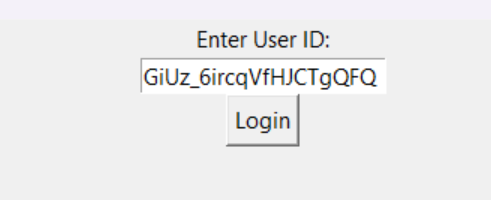
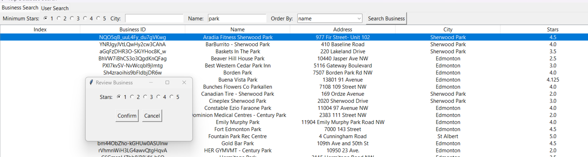

# Yelp Database Search Application

This is a simple showcase of my knowledge with databases and SQL.

## Overview

This application allows users to search and view data from the Yelp database, including information about businesses and users, using SQLite.

## Usage Instructions

### Requirements

- Python 3.x installed on your system
- Required Python libraries: `sqlite3`, `tkinter` (both included in Python), `pandas`

### Setting Up the Database

1. Ensure Python is installed:
   ```sh
   python --version
   ```
   If not installed, download from [Python's official website](https://www.python.org/downloads/).

2. Ensure `pip` is installed (Windows users can run):
   ```sh
   py -m ensurepip --upgrade
   ```

3. Install the required libraries using pip:
   ```sh
   pip install pandas
   ```

4. Run the database setup script:
   ```sh
   python setup_database.py
   ```
   This will create the SQLite database (`yelp.db`) and execute the table creation script.

5. Import data into the database:
   ```sh
   python import_data.py
   ```
   This script will populate the tables with sample data.

6. Add triggers to the database:
   ```sh
   python setup_triggers.py
   ```
   This ensures database constraints and automated actions are correctly applied.

### Running the Application

1. Open a terminal or command prompt.
2. Navigate to the directory containing the application files.
3. Run the main application:
   ```sh
   python main.py
   ```
4. Enter a valid User ID to log in and access search functionalities. For example `bashdkGiUz_6ircqVfHJCTgQFQ`





### Using the Application

- After logging in, you'll see two tabs: **Business Search** and **User Search**.
- **Business Search:**
  - Search for businesses based on criteria like name, city, or minimum stars.
  - View and filter the list of businesses.
  - Click on a business to add a review.
  

- **User Search:**
  - Search for users based on criteria like name, review count, or average stars.
  - View and filter the list of users.
  - Click on a user to send a friend request.
  


### Notes

- This application uses an SQLite database (`yelp.db`). Ensure the database file is present in the project directory.
- Make sure to close the application properly using the window close button.

### Troubleshooting

If you encounter any issues, check the database setup steps and verify that `yelp.db` is created successfully.

